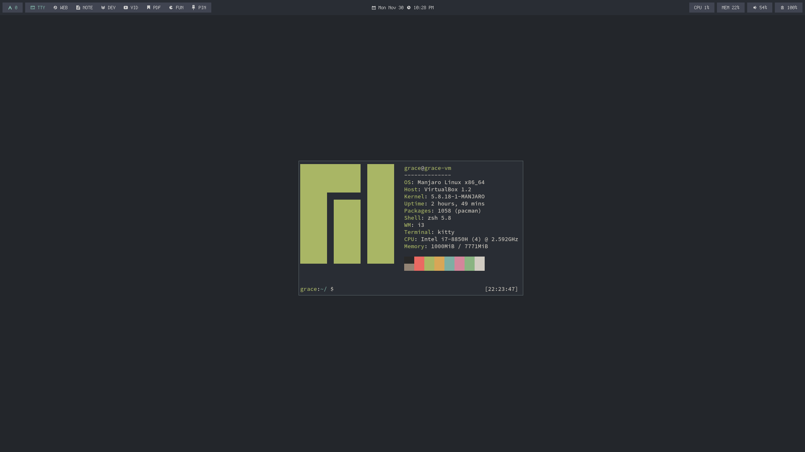
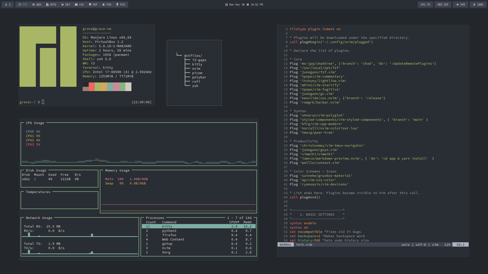
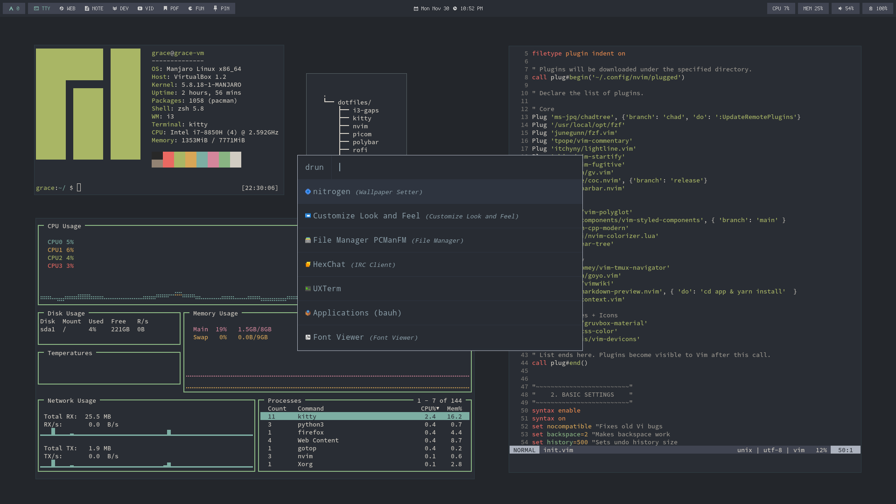

# dotfiles (manjaro)

Building out dotfiles for a Manjaro i3 setup. Lots of learning in progress.

* [ ] i3-gaps
* [X] kitty
* [ ] alacritty
* [X] nvim
* [ ] picom
* [ ] polybar
* [X] rofi
* [X] zsh

## TODO

* [ ] `picom.conf`
* [ ] Create install script to automate process
* [ ] Find wallpaper
