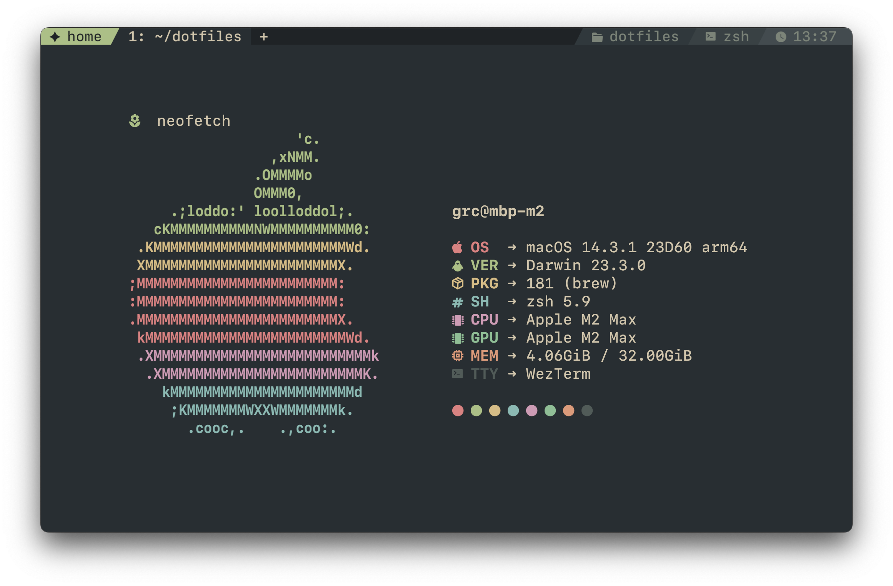

# dotfiles

dotfiles for my primary laptop, a macbook pro (14-inch, 2023) with the apple m2 max chipset, running macos ventura.

- homebrew
- iterm2
- zsh
- starship
- neovim
- tmux
- bat
- git with git-delta
- mpv
- neofetch
- ~~zathura~~ sioyek
- raycast
- [enjoyable](https://yukkurigames.com/enjoyable/)
- [warpd](https://github.com/rvaiya/warpd)

## see also

- [dotfiles for Pop!\_OS](https://github.com/grcekh/dotfiles/tree/pop)
- [dotfiles for Manjaro i3](https://github.com/grcekh/dotfiles/tree/manjaro)
