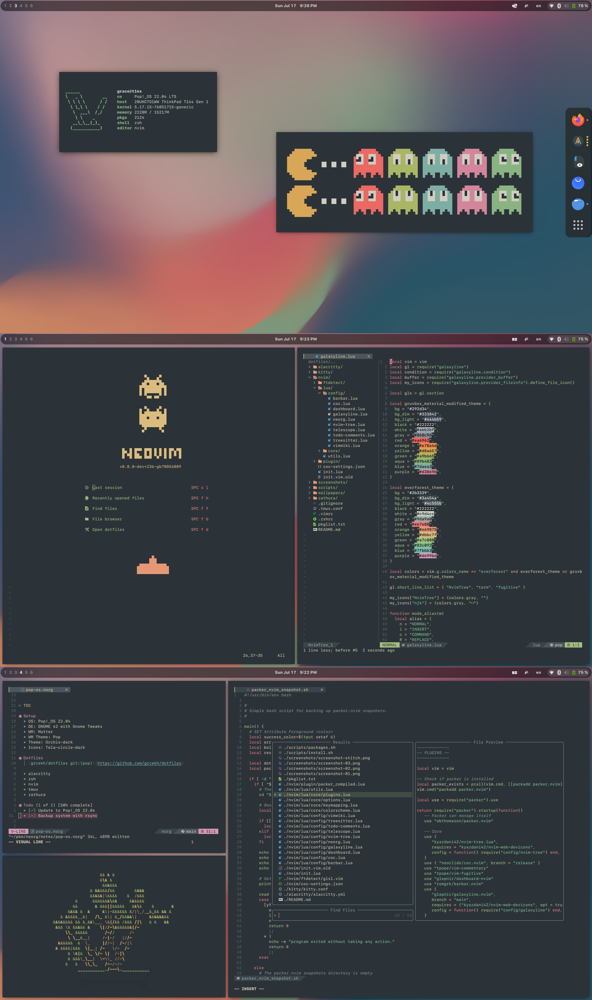

# dotfiles (pop)

Dotfiles for Pop!\_OS on the Intel Thinkpad T14s.

- [x] alacritty
- [x] zsh
- [x] nvim
- [x] tmux
- [x] zathura
- OS: Pop!\_OS 22.04
- DE: GNOME 42
- WM: Mutter
- WM Theme: Pop
- Theme: Orchis-dark [GTK2/3]
- Icons: Tela-circle-dark [GTK2/3]

